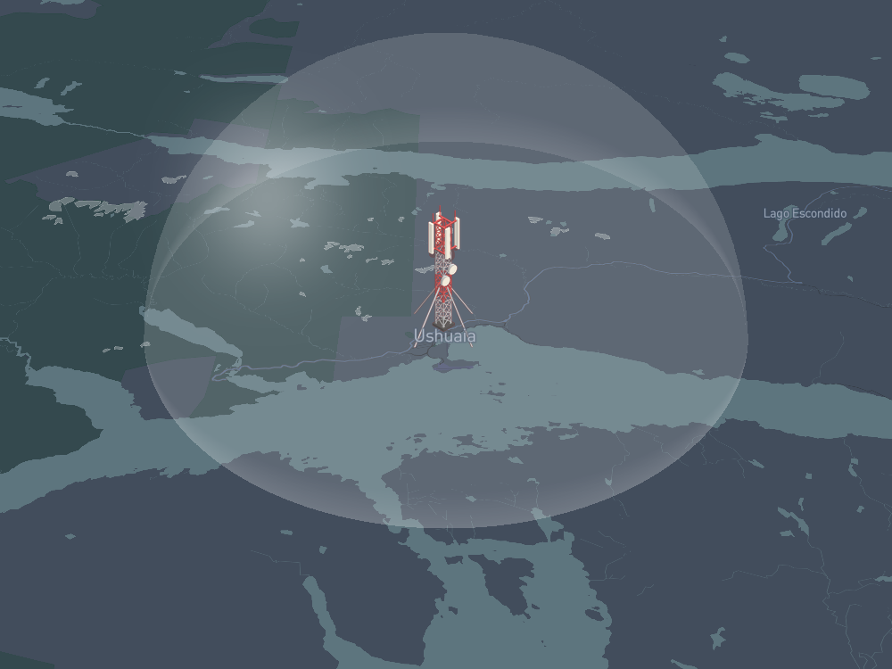
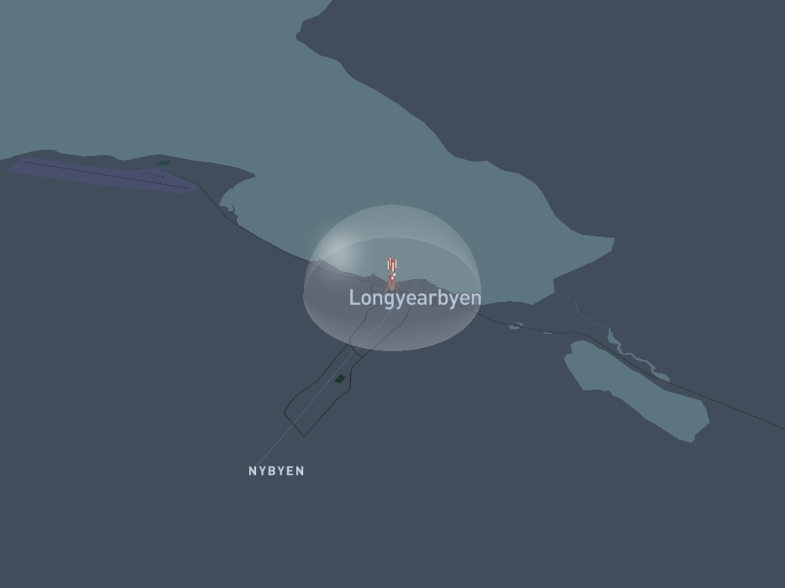

# FOAM-Signals Visualization

The package enables user to request a FOAM signal visualization by providing its ID. Visualization includes:

 * mapbox map showing area around the signal; 
 * beacon showing location of the signal 
 * and a dome representing range of the signal.

Map images © [Mapbox](https://www.mapbox.com/about/maps/) © [OpenStreetMap](https://www.openstreetmap.org/copyright)

Beacon visuals © [Macrovector](https://www.freepik.com/macrovector)

### Visualization of signal #223


# Examples
Dome size, map zoom and beacon size depend on signal's radius. FOAM signals radius can range from 1 to 25 km.

Signals radii: **1km --> 5km --> 25km**
#### Ushuaia - 54.8°S
  
#### Quito - 0.1°S
  
#### New York - 40.7°N
  
#### Longyearby - 78.2°N
  

With Mapbox-maps zoom depends on latitude, [click here](https://docs.mapbox.com/help/glossary/zoom-level/) for an explanation.

# Workings

#### Signal data
 - Web3 call to FOAM [SignalToken contract](https://etherscan.io/address/0x36f16a0d35b866cdd0f3c3fa39e2ba8f48b099d2)
 - [API call](https://petstore.swagger.io/?url=https://map-api-direct.foam.space/swagger.json#/foam/get_signal_details__cstHash_) for geohash

#### Mapbox static maps
 - [API call](https://docs.mapbox.com/help/how-mapbox-works/static-maps/?utm_medium=sem&utm_source=google&utm_campaign=sem|google|brand|chko-googlesearch-pr01-dynamicsearchcampaign-nb.broad-all-landingpage-search&utm_term=brand&utm_content=chko-googlesearch-pr01-dynamicsearchcampaign-nb.broad-all-landingpage-search) for normal map without roads and labels
 - API call for map with roads only
 - API call for map with labels only

 This enables putting a layer in between ground, labels and roads.

#### Drawing a dome
 - Semi-circle (0° --> 180°)
 - Semi-ellipse (0° --> -180°)
 - Ellipse outline arcs fading with distance
 

# Usage

Please log bugs and feature requests to issues. Develop and add your own features by creating a pull request.

#### Install dependencies in a new virtual environment:
```bash
$ virtualenv env
$ source env/bin/activate
$ pip install -r requirements.txt
```

#### Create an `.env` file:

```bash
MAPBOX_TOKEN = xxxxx
WEB3_INFURA_PROJECT_ID = xxxxx
```
Create Mapbox token [here](https://account.mapbox.com/access-tokens/).
Create Infura API key [here](https://infura.io/product).
 
#### Run with signal ID:
Include `--save` to save the visualization and `--show` to display it with the default image viewer.
```bash
$ python main.py <signal_id> [--show] [--save [<path>]]
```
Try it out with signal #223:
```bash
$ python main.py 223 --show
```
#### Run without signal ID:
User can provide its own parameters instead of calling a signal. 
In `visualizer.py` there is a function `visual_from_data` which takes coordinates and radius as parameters. 
Look at `run_examples.py` for some examples.

   Polar explorers note! Mapbox only allows latitude **<= 85°N** and >= **85°S**.
